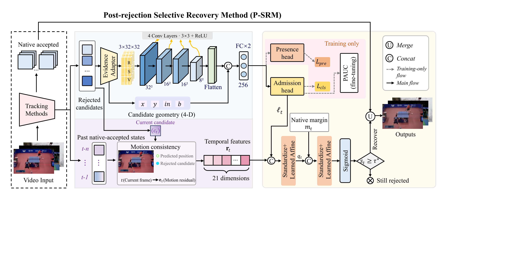
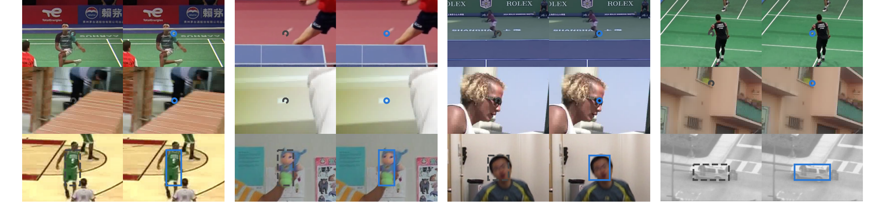

# P-SRM

A lightweight method for recovering correctly localized but rejected predictions in visual tracking.

## Overview

A tracker can reject a prediction even when its candidate is already correctly localized. P-SRM studies this recoverable part of tracking failure: it scores rejected candidates using spatial evidence, causal native history and the native decision margin, then selectively readmits them.

P-SRM keeps candidate coordinates and all native acceptances unchanged. Recovered predictions do not update the host tracker's state or the trusted history. Ground truth is used only for training, calibration and evaluation.

[](assets/overview.svg)

The evidence adapter organizes spatial evidence and candidate geometry for the quality network. Its output is fused with past native-accepted states and the native margin to decide recovery. Dashed arrows show training-only paths. [Open the vector figure](assets/overview.svg).

## Examples

Selected qualitative examples from the manuscript. In each pair, **left: Native**, **right: +P-SRM**. Gray dashed markers indicate rejected candidates; blue markers show those same candidates after recovery, at unchanged coordinates.

[](assets/recovery_examples.png)

| Row | Tracker | Examples and data source |
| --- | --- | --- |
| Top: category-specific tracking | TrackNetV3 | Badminton, table tennis and tennis from RacketVision training; badminton from Shuttlecock Test |
| Middle: point tracking | TAP-Net | Laying bricks, sipping a cup, sanding wood and pirouetting from Kinetics development |
| Bottom: generic object tracking | KCF | Basketball, Doll, Boy and Suv from OTB2013 out-of-fold records |

These selected illustrations show the recovery mechanism; their mixed source settings are identified above. They do not represent an additional evaluation set.

## Installation

Python 3.10 or newer is required. Install a matching PyTorch and torchvision pair for your machine, then install P-SRM:

```bash
git clone https://github.com/PalestyHR/P-SRM.git
cd P-SRM
python -m venv .venv
# Linux/macOS
source .venv/bin/activate
# Windows PowerShell: .venv\Scripts\Activate.ps1
python -m pip install --upgrade pip
python -m pip install -e ".[train,data,test]"
```

CPU is sufficient for the quick example and model use. Training and native point-tracker export are intended for a CUDA environment. Host-specific dependencies and original checkpoint sources are listed in [data preparation](docs/data.md). The [environment notes](docs/environment.md) distinguish the paper environments from the local package smoke test.

## Quick Start

The repository includes compact P-SRM weights. Run a synthetic interface example without downloading a tracking dataset:

```bash
python examples/quick_start.py --weights weights/tapnet --device cpu
```

Expected first line:

```text
P-SRM QUICK START OK: 3 candidates; original coordinates and native acceptances preserved.
```

For your own tracker:

```python
from psrm import RecoveryModel

psrm = RecoveryModel("weights/tapnet", device="cpu")
positions, final_valid = psrm.recover(
    positions, native_valid,
    dense_evidence, candidate_metadata, history, native_margin,
)
```

Evidence, metadata, history and margins contain **rejected candidates only**, in rejection order. Use the bundle matching the host and training domain. See the [host interface](docs/interface.md) for shapes, coordinate conventions and history updates.

## Supported Trackers

| Host | Paper setting | P-SRM model bundle |
| --- | --- | --- |
| TAP-Net | Kinetics Design → separate Closure videos | `weights/tapnet` |
| Online TAPIR | Kinetics Design → separate Closure videos | `weights/online-tapir` |
| TAPNext++ | Kinetics Design → TAP-Vid DAVIS | `weights/tapnext` |
| TrackNetV1 | Shuttlecock / RacketVision | `weights/tracknetv1_<dataset>` |
| TrackNetV2 | Shuttlecock / RacketVision | `weights/tracknetv2_<dataset>` |
| TrackNetV3 | Shuttlecock / RacketVision | `weights/tracknetv3_<dataset>` |
| KCF | OTB2013, grouped five-fold evaluation | `weights/kcf/fold_<i>` |

TrackNet uses the official Test partition for Shuttlecock and Validation for RacketVision. KCF is an OOF experiment, not an independent-test result. The bundled models use seed 42; the training configurations also specify the paper's repeated seeds where applicable.

OTB2013 provides bounding-box annotations but lacks the explicit per-frame visibility labels required by our P-SRM training and evaluation protocol. We therefore provide an OTB2013 visibility supplement, containing reusable visibility labels and the annotation prompt, without redistributing the original images.

The reusable [OTB2013 visibility supplement](annotations/otb2013/README.md) contains labels and the annotation prompt, without images.

## Reproduce Results

1. Obtain the original datasets and native checkpoints from their sources.
2. Prepare host evidence with the supplied [data preparation commands](docs/data.md) and published group splits.
3. Evaluate a supplied P-SRM model or retrain the selected recipe.

Example, after preparing TAP-Net evaluation data:

```bash
python -m psrm.reproduce evaluate --config configs/tapnet.json --data data/tapnet/evaluation --weights weights/tapnet --output outputs/tapnet --device cuda
```

To train the quality network, apply Task-KL, fit causal and margin readouts on source data, calibrate the threshold on grouped OOF scores, and evaluate:

```bash
python -m psrm.reproduce train --config configs/tapnet.json --data data/tapnet --output runs/tapnet/seed_42 --seed 42 --device cuda
```

[Reproduction details](docs/reproduce.md) cover other hosts, repeated seeds, metric definitions and ablations. Generated outputs stay in your local output directory.

Run the package checks:

```bash
python -m pytest -q
```

## Citation

Paper bibliographic details will be added when publication metadata is confirmed. For this code repository:

```bibtex
@misc{psrm_code,
  title = {{P-SRM}: Visual Tracking with Post-Rejection Selective Recovery},
  author = {{P-SRM contributors}},
  year = {2026},
  howpublished = {\url{https://github.com/PalestyHR/P-SRM}}
}
```

## Acknowledgements / License

P-SRM builds on the released trackers and datasets listed in [THIRD_PARTY.md](THIRD_PARTY.md), and uses LibAUC for the one-way partial-AUC training objective. Original trackers, datasets and checkpoints retain their own terms.

This repository is a private review copy. The public license has not yet been assigned; see [LICENSE](LICENSE). Third-party native model weights and full datasets are not bundled. The Overview and Examples figures include selected annotated frames for illustration.
